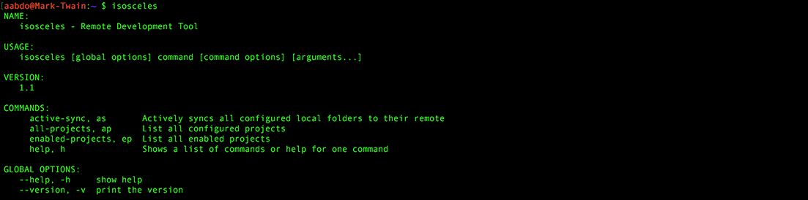
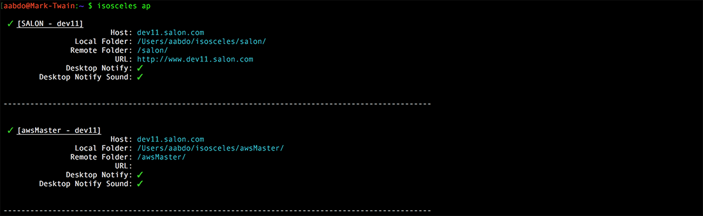

# isosceles
> Remote Development Tool

[](https://travis-ci.org/murdinc/isosceles)

## Intro
**isosceles** is a tool built out of a desire to work locally in an environment set up for remote development. I got tired of the lag of a mounted sshfs volume. It's main and only feature is "active-sync", currently - but I hope to add more utilities to it as needed.

To set up projects, add an .isosceles file to your user folder on OS X. An example is located in the example_config.isosceles file in this repo and at the end of the README. A compiled executable is located in the bin folder, if you don't want to run golang and compile it yourself.

## Features
* Watches an entire directory recursively for changes that match a specific pattern
* Kicks off an rsync when a trigger is detected.
* Pools triggers that happen during the cooldown period (set in the config), to keep from repeating useless syncs.
* rsync flags are fully customizable in the config
* Desktop Notifications can be enabled, with or without sound, for when triggers are processed.

## Installation
1. Install Go (if you haven't already): https://golang.org/doc/install

2. Download and install isosceles:

  `$ go get -u github.com/murdinc/isosceles`

3. If `$GOPATH/bin` is not yet in your `$PATH` (check with `$ echo $PATH`):

  `$ export PATH="$PATH:$GOPATH/bin"`

4. Test it! `$ go test github.com/murdinc/isosceles/...`

```
$ go test github.com/murdinc/isosceles/...
ok  	github.com/murdinc/isosceles	0.010s
```

## Screenshots

**CLI Menu:**



**Listing All Projects:**



**Active Sync:**


**Desktop Notifications:**


**Example configuration: (goes in ~/.isosceles)**


## Roadmap
* tail of remote logs - WIP

## Example Config

```

# isosceles config
###############################################################################################

[project "MacGruber1"]

    # Enabled this project in active-sync
    #################################################################
    enabled = true

    # Perform Initial Sync when active-sync is started?
    #################################################################
    initial-sync = true

    # Host and Folders Information
    #################################################################
    host = "host.name.com"
    local-folder = "/Users/USER/isosceles/PROJECT/"
    remote-folder = "/PROJECT/"

    # Watch Pattern for file change triggers
    #################################################################
    watch-pattern = "(.*\\.php|.*\\.css|.*\\.html|.*\\.js)"

    # Rsync Arguments, joined in order
    #################################################################
    rsync-arg = "-l"
    rsync-arg = "-r"
    rsync-arg = "-O"
    rsync-arg = "--dry-run"
    rsync-arg = "--stats"
    rsync-arg = "--progress"
    rsync-arg = "--delete"
    rsync-arg = "--no-owner"
    rsync-arg = "--no-group"
    rsync-arg = "--exclude=.git"
    rsync-arg = "--exclude=.git_ignore"

    # Wait period (in seconds) between concurrent syncs, to allow for changes
    # to batch together if there are a lot of files
    #################################################################
    cooldown = 1

    # Open the browser when active-sync is turned on
    #################################################################
    open-browser = true
    url = "http://www.host.name.com"

    # Mac OSX Notifications when sync triggers are executed
    #################################################################
    desktop-notify = true
    desktop-notify-sound = true

    # Enable/Disable log tails - todo
    #################################################################
    tail-error = true
    tail-access = true
    tail-extra = false

    # Log paths
    #################################################################
    error-log = "/var/log/nginx/*.access.log"
    access-log = "/var/log/nginx/*.error.log"
    extra-log = ""

