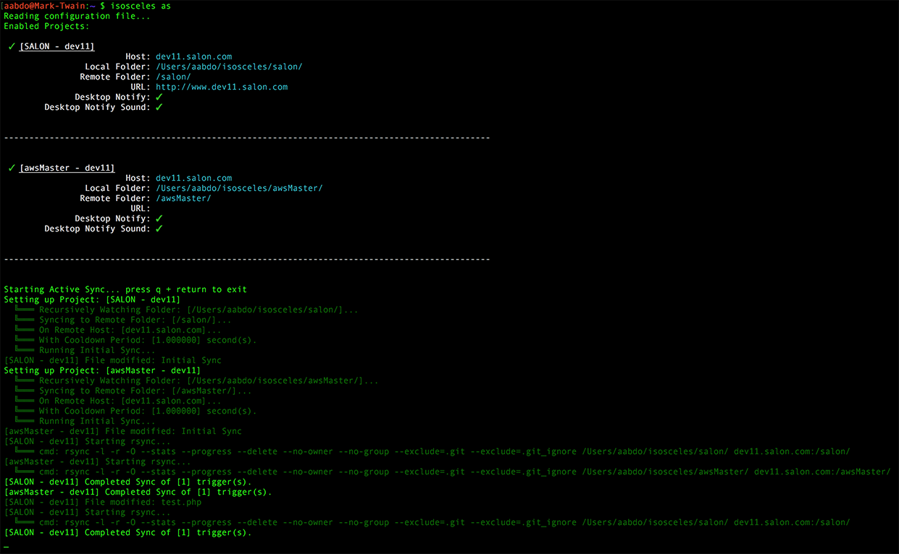

# isosceles
> Remote Development Tool

[](https://travis-ci.org/murdinc/isosceles)

## Intro
**isosceles** is a tool built out of a desire to work locally in an environment set up for remote development. It's basically a wrapper for rsync that watches for file changes.

To set up projects, add an .isosceles file to your user folder on OS X. An example is located in the example_config.isosceles file in this repo and at the end of the README.

## Features
* Watches an entire directory recursively for changes that match a specific pattern
* Kicks off an rsync when a trigger is detected.
* Pools triggers that happen during the cooldown period (set in the config), to keep from repeating useless syncs.
* rsync flags are fully customizable in the config
* Desktop Notifications can be enabled, with or without sound, for when triggers are processed.

## Installation
1. Copy and paste the following into Terminal:

  `wget https://github.com/murdinc/isosceles/releases/download/v1.1/isosceles -O isosceles.temp; mv isosceles.temp /usr/local/bin/isosceles; chmod 775 /usr/local/bin/isosceles;`

2. Create an `.isosceles` file in your home directory (`~/.isosceles`) using the example configuration below. 

3. Run the command `isosceles` to see the help menu and get started.   


## Development
These steps are only required if you wish to develop on the isosceles code, or compile it yourself.

1. Install Go (if you haven't already): https://golang.org/doc/install

2. Download and install isosceles:

  `$ go get -u github.com/murdinc/isosceles`

3. If `$GOPATH/bin` is not yet in your `$PATH` (check with `$ echo $PATH`):

  `$ export PATH="$PATH:$GOPATH/bin"`

4. Test it! `$ go test github.com/murdinc/isosceles/...`

```
$ go test github.com/murdinc/isosceles/...
ok      github.com/murdinc/isosceles    0.010s
```


## Screenshots

**CLI Menu:**


**Listing All Projects:**


**Active Sync:**



**Desktop Notifications:**


**Example configuration: (goes in ~/.isosceles)**


## Example Config

```

[project "Project1"]

    # Enabled Flag
    enabled = true

    # Host and Folders
    host = "host.name.com"
    local-folder = "/Users/USER/isosceles/PROJECT/"
    remote-folder = "/PROJECT/"
    url = "http://www.host.name.com"

    # Watch Pattern
    watch-pattern = "(.*\\.php$|.*\\.css$|.*\\.html$|.*\\.js$)"

    # Rsync Arguments
    rsync-arg = "-l"
    rsync-arg = "-r"
    rsync-arg = "-O"
    #rsync-arg = "--dry-run"
    rsync-arg = "--stats"
    rsync-arg = "--progress"
    rsync-arg = "--delete"
    rsync-arg = "--no-owner"
    rsync-arg = "--no-group"
    rsync-arg = "--exclude=.git"
    rsync-arg = "--exclude=.git_ignore"

    # Wait between concurrent syncs, to allow for changes to batch together
    cooldown = 1 # second

    desktop-notify = true
    desktop-notify-sound = true

